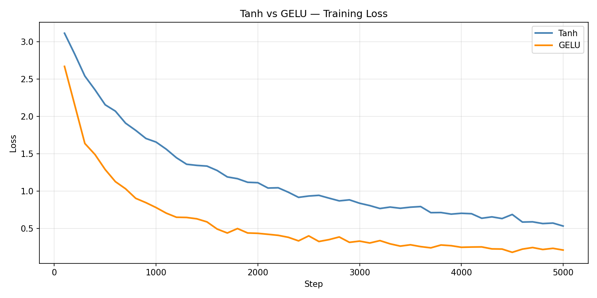
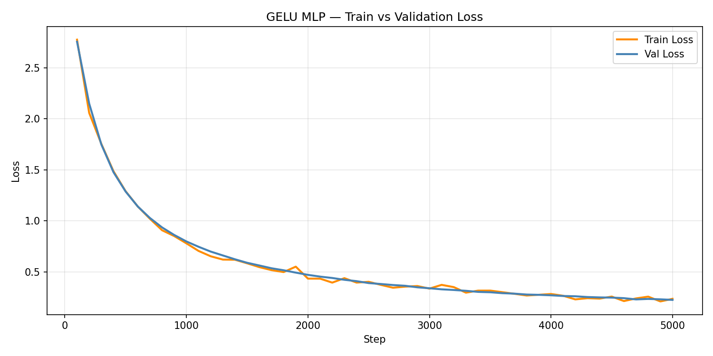
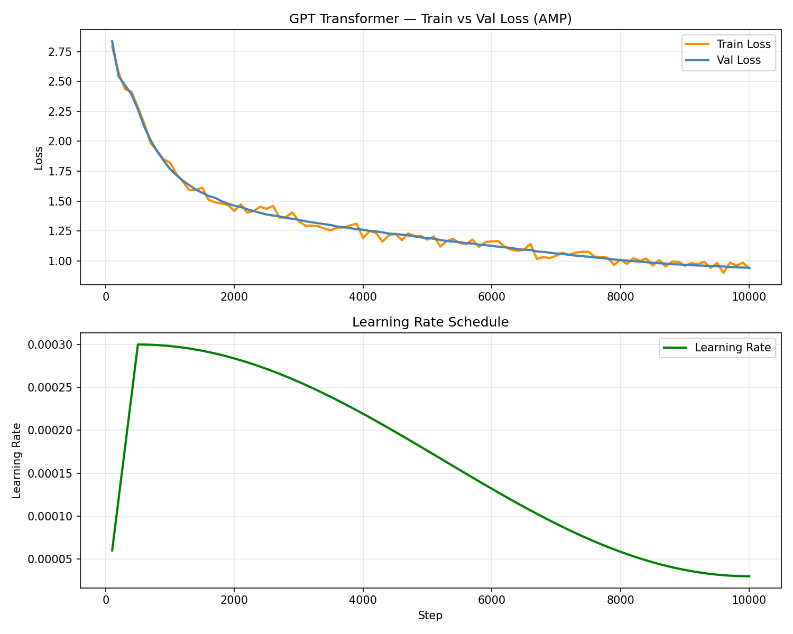

# SLM — Small Language Model from Scratch

Built a character-level language model from scratch in PyTorch, progressing from a simple MLP baseline to a GPT-style transformer with BPE tokenization. Every component implemented manually — no HuggingFace, no `nn.Transformer`, no shortcuts.

**Dataset:** Tiny Shakespeare (1.1M characters) | **GPU:** RTX 3050 6GB | **Framework:** PyTorch 2.7 + CUDA 12.8

---

## Project Structure

```
slm/
├── data/input.txt                 ← Tiny Shakespeare corpus
├── char_lm/                       ← Phase 0: MLP baseline
│   ├── dataset.py                 ← Character tokenizer + Dataset
│   ├── model_tanh.py              ← MLP with Tanh activation
│   ├── model_gelu.py              ← MLP with GELU activation
│   ├── bpe_tokenizer.py           ← BPE tokenizer from scratch
│   ├── dataset_bpe.py             ← Dataset using BPE tokenizer
│   └── bpe_1000.json              ← Pre-trained BPE vocab (1000 tokens)
├── transformer/                   ← Phase 1: GPT-style transformer
│   ├── attention.py               ← Single + Multi-head attention
│   ├── transformer.py             ← TransformerBlock + GPTModel
│   ├── train.py                   ← GPT-6L-128D training script
│   ├── train1.py                  ← GPT-8L-256D + AMP training script
│   └── train_bpe.py               ← GPT-8L-256D + BPE + AMP training
├── weights/
│   ├── gpt_8l_256d_amp.pt         ← Char tokenizer model weights
│   └── gpt_8l_256d_bpe1000_amp.pt ← BPE model weights (best)
└── train.py                       ← MLP experiment (Tanh vs GELU)
```

---

## Phase 0 — MLP Baseline

**Architecture:** `Embedding → Flatten → Linear → Activation → Linear → Logits`

The MLP flattens all token embeddings into one vector before prediction — destroying positional relationships. This is the architectural ceiling the transformer was built to break.

### Experiment: Tanh vs GELU

Controlled ablation — identical architecture, only activation changed:

| Activation | Step 100 | Final Loss | Notes |
|---|---|---|---|
| Tanh | 2.57 | 0.27 | Collapsed to `&&&&` at larger scale |
| GELU | 1.93 | 0.21 | Stable throughout |

**Finding:** At larger context (block_size=32, 1.1M params) Tanh neurons saturated and collapsed. GELU's unbounded positive side kept gradients healthy. Proved empirically — not just from reading.

---

## Phase 1 — GPT-Style Transformer

### Components Built from Scratch

**Causal Self-Attention:**
```
Q, K, V = x @ W_q,  x @ W_k,  x @ W_v
scores  = Q @ K.T / sqrt(head_size)
scores  = masked_fill(future → -inf)
output  = softmax(scores) @ V
```

**Multi-Head Attention** — N heads in parallel, each learning different relationship types. Outputs concatenated and projected back to `d_model`.

**Transformer Block:**
```python
x = x + attention(layernorm(x))    # pre-norm residual
x = x + feedforward(layernorm(x))  # pre-norm residual
```

**Residual connections** let gradients flow directly to early layers — enables training 8 blocks deep without vanishing gradients.

### Training Infrastructure

| Technique | What it does |
|---|---|
| AdamW | Adaptive per-weight LR + weight decay — standard LLM optimizer |
| Gradient clipping | Cap gradient norm at 1.0 — prevents single bad batch destroying training |
| LR warmup | Ramp LR 0 → max over 500 steps — prevents early instability |
| Cosine decay | Smoothly reduce LR to min — precise convergence at end |
| Mixed precision (AMP) | Forward float16, backward float32 — 40% less memory, faster |
| Gradient scaling | Prevents float16 underflow of tiny gradients |
| Validation loss | 10% held-out data every 100 steps — catches overfitting |

---

## Phase 2 — BPE Tokenizer

Built Byte Pair Encoding from scratch — the same algorithm used by GPT-2.

**Algorithm:**
1. Start with individual characters as base vocabulary (65 tokens)
2. Count all adjacent token pairs across the full corpus
3. Merge the most frequent pair into a new token
4. Repeat until target vocabulary size reached

```
merge 100: 'e' + '</w>'   → 'e</w>'    ← word endings
merge 200: 'h' + 'ea'     → 'hea'      ← syllables
merge 300: 'fu' + 'l</w>' → 'ful</w>'  ← suffixes
merge 400: 'wa' + 'y</w>' → 'way</w>'  ← complete words
```

**Result at vocab_size=1000:**

| | Char tokenizer | BPE-1000 |
|---|---|---|
| Vocab size | 65 | 1000 |
| Corpus tokens | 1,115,394 | 494,773 |
| Compression | 1× | 2.25× |
| Context coverage | ~20 words per window | ~50 words per window |

```
Input: "What light through yonder window breaks"

Char (38 tokens): W h a t   l i g h t   t h r o u g h ...
BPE  (7 tokens):  What  light  through  yonder  window  breaks
```

---

## Results — Full Progression

| Model | Params | Tokenizer | Block | Steps | Val Loss | Perplexity | Time |
|---|---|---|---|---|---|---|---|
| MLP Tanh | 335K | char-65 | 8 | 5000 | 0.27 | 1.31 | 40s CPU |
| MLP GELU | 1.1M | char-65 | 32 | 5000 | 0.21 | 1.23* | 19s GPU |
| Transformer 4L-64D | 209K | char-65 | 32 | 5000 | 1.65 | 5.21 | 174s |
| Transformer 6L-128D | 1.2M | char-65 | 32 | 10000 | 1.37 | 3.94 | 406s |
| + Block 128 | 1.2M | char-65 | 128 | 10000 | 1.32 | 3.74 | 660s |
| + AMP | 1.2M | char-65 | 128 | 10000 | 1.34 | 3.82 | 555s |
| GPT-8L-256D + AMP | 6.4M | char-65 | 128 | 10000 | 0.94 | 2.56 | 1928s |
| **GPT-8L-256D + BPE + AMP** | **6.9M** | **BPE-1000** | **128** | **10000** | **0.26** | **1.30** | **1762s** |

> *MLP perplexity 1.23 is misleading — it memorized character statistics, not language structure.
> The BPE transformer at perplexity 1.30 generates coherent multi-play Shakespeare dialogue.

---

## Generated Samples

### Character Tokenizer — GPT-8L-256D (val loss 0.94)

**`ROMEO:`**
```
ROMEO:
Good night, I might be offenced me.
Come our hopings to enjoy, upon thy face,
That sees thus spoke them wounds, that she doth her
The seal of heavenly stubble that h
```

**`First Citizen:`**
```
First Citizen:
To sweet sorrow to be tide 'gainst God's majesty!
JULIET:
It is, my lord.
```

### BPE Tokenizer — GPT-8L-256D (val loss 0.26)

**`ROMEO:`**
```
ROMEO: LORD ROSS: At fear how quiet, ladicious to From all rance;
Show we will help you yet, adilia.
DUKE OF YORK: Which is my sisterhred is loved?
HENRY BOLINGBROKE: Then, my liege,
Which way to take her, to make the Timeless play--
```

**`First Citizen:`**
```
First Citizen: in these fire; and we are like to meet your confersul.
DUKE VINCENTIO: Then is a spotrealing, to acquior of her privilege
Why feed the devil, where roatten hate and waken
Barnardine and Romeo comes in Rome!
```

> BPE model references HENRY BOLINGBROKE, DUKE OF YORK, DUKE VINCENTIO, Barnardine
> and Romeo — real characters from different Shakespeare plays. The model learned the
> entire canon as an interconnected world.

---

## Use Pre-trained Weights

Download weights from the `weights/` folder and run inference directly:

```python
import torch
import torch.nn.functional as F
import sys
sys.path.append('.')

from transformer.transformer import GPTModel
from char_lm.bpe_tokenizer import BPETokenizer

DEVICE     = "cuda" if torch.cuda.is_available() else "cpu"
BLOCK_SIZE = 128

# load tokenizer
tokenizer = BPETokenizer()
tokenizer.load("char_lm/bpe_1000.json")

# load model
model = GPTModel(
    vocab_size = tokenizer.vocab_size,
    block_size = BLOCK_SIZE,
    d_model    = 256,
    n_heads    = 8,
    n_layers   = 8,
)
model.load_state_dict(torch.load("weights/gpt_8l_256d_bpe1000_amp.pt",
                                  map_location=DEVICE))
model = model.to(DEVICE)
model.eval()

# generate
prompt = "ROMEO:"
ids    = tokenizer.encode(prompt)

if len(ids) < BLOCK_SIZE:
    ids = [ids[0]] * (BLOCK_SIZE - len(ids)) + ids

idx = torch.tensor([ids], dtype=torch.long, device=DEVICE)

with torch.no_grad():
    for _ in range(200):
        idx_cond = idx[:, -BLOCK_SIZE:]
        logits, _ = model(idx_cond)
        logits = logits[:, -1, :] / 0.8
        probs  = F.softmax(logits, dim=-1)
        next_id = torch.multinomial(probs, num_samples=1)
        idx = torch.cat([idx, next_id], dim=1)

print(tokenizer.decode(idx[0].tolist()))
```

---

## Key Concepts

| Term | One-liner |
|---|---|
| Tokenization | Text → integers via char→index dictionary |
| BPE | Iteratively merge most frequent token pairs — discovers subword structure |
| Embedding | Learnable lookup table — token ID → dense vector |
| Positional embedding | Learned position vectors added to token embeddings |
| Causal mask | Lower triangular — tokens can't attend to future positions |
| Multi-head attention | N parallel attention heads, each learning different patterns |
| Residual connection | `x = x + layer(x)` — preserves signal, enables depth |
| LayerNorm | Normalize each token vector — stabilizes activations |
| Cross-entropy loss | `-log(prob of correct token)` — the training signal |
| AdamW | Adaptive per-weight LR + weight decay — standard LLM optimizer |
| Gradient clipping | Cap gradient norm — prevents catastrophic updates |
| LR warmup | Ramp from 0 → max LR — stable early training |
| Cosine decay | Smooth LR reduction — precise late convergence |
| Mixed precision | float16 forward + float32 backward — memory efficient |
| Gradient scaling | Prevents float16 underflow during AMP training |
| Validation loss | Held-out loss — confirms generalization not memorization |
| Temperature | Divide logits by T — controls generation randomness |
| Perplexity | `exp(val_loss)` — average equally-likely next tokens |

---

## Training Curves





---

## How to Run

```bash
# Install
pip install torch torchvision torchaudio --index-url https://download.pytorch.org/whl/cu128
pip install matplotlib numpy

# Data
curl -o data/input.txt https://raw.githubusercontent.com/karpathy/char-rnn/master/data/tinyshakespeare/input.txt

# MLP experiment (Tanh vs GELU)
python train.py

# Transformer char tokenizer
python transformer/train1.py

# Train BPE tokenizer
python char_lm/bpe_tokenizer.py

# Transformer + BPE (best model)
python transformer/train_bpe.py
```

---

## What I Learned

- Why attention beats MLPs — flat context destroys positional structure
- Why GELU beats Tanh at scale — proved empirically with `&&&&` collapse
- Why loss ≠ generation quality — MLP at 0.21 generated gibberish, transformer at 0.94 generated iambic pentameter
- Why LR scheduling matters — same final quality in 3× less time
- How BPE discovers language structure — pure frequency counting finds morphemes with zero linguistic knowledge
- Why tokenizer choice matters as much as architecture — same model, char vs BPE: perplexity 2.56 → 1.30
- How mixed precision works mechanically — float16 needs gradient scaling to not underflow
- How to build a real training pipeline — val loss, checkpointing, grad clipping, AMP


